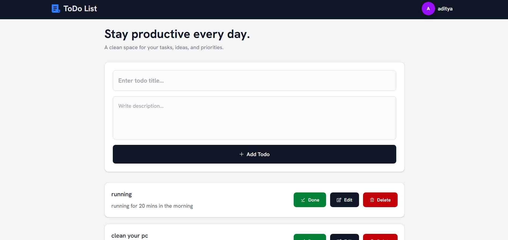
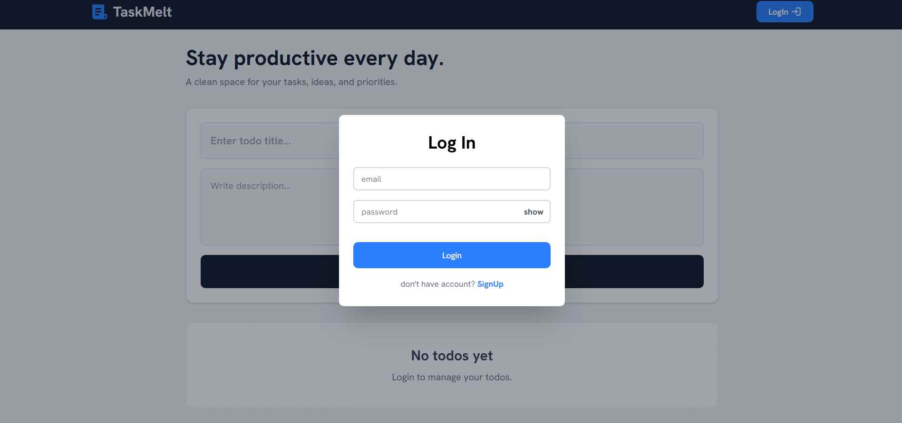
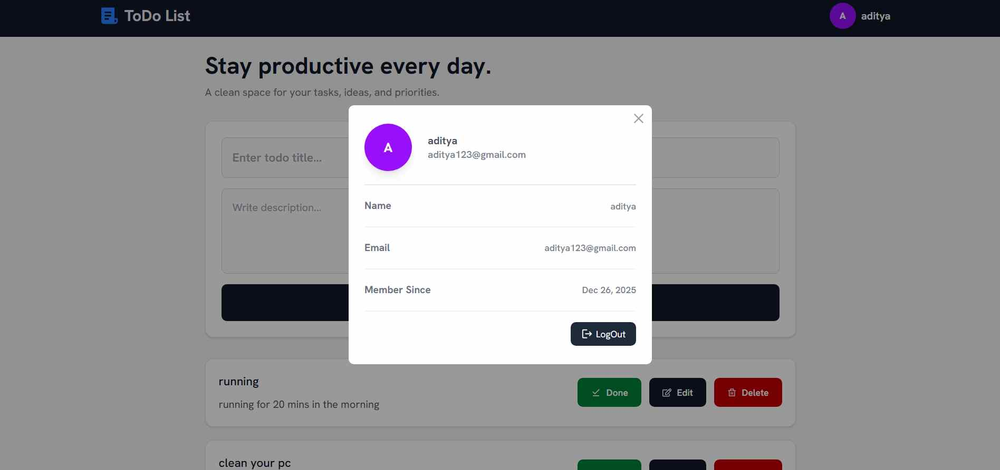

# TaskMelt

A full-stack task management application built with React, Node.js, Express, and MySQL.  
The application allows authenticated users to manage daily tasks with secure JWT authentication and responsive UI.

Built as a project-based learning application to improve full-stack development skills, backend architecture, authentication flow, and database management using MySQL.

---

## Live Demo

https://fullstack-todo-app-nu.vercel.app/

---

## Screenshots

### Home Page

### Login Page

### Profile Page

---

## Features

- JWT-based Authentication
- User Signup & Login
- Create, Update, Delete Todos
- Mark Tasks as Completed
- Separate Profile Page for Users
- Responsive UI Design
- Protected Routes
- Context API State Management
- REST API Integration
- MVC Backend Architecture

---

## Tech Stack

### Frontend
- React.js
- Tailwind CSS
- Context API
- Axios
- React Router DOM

### Backend
- Node.js
- Express.js

### Database
- MySQL

### Authentication
- JWT (JSON Web Token)

### Deployment
- Vercel (Frontend)
- Render (Backend)
- Aiven (Database Hosting)

---

## What I Learned

This project helped me improve my understanding of:

- Full-stack MERN-style architecture with MySQL
- JWT authentication flow
- MySQL database integration
- MVC backend structure
- Context API state management
- REST API handling
- Deployment of frontend, backend, and cloud database services
